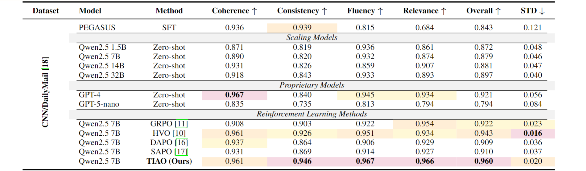

<a id="top"></a>

<div align="center">
  
  <h1>TIAO</h1>
  <p><strong>Token Importance-Aware Optimization for Text Summarization</strong></p>
  <p>
    
    
    
    
    
    
  </p>
</div>

TIAO adds hierarchical token-level credit assignment to group-relative policy optimization for abstractive summarization.

<a id="table-of-contents"></a>

## 📑 Table of Contents

- [📌 Overview](#overview)
- [🧠 Method](#method)
- [✨ Key Features](#key-features)
- [📊 Results](#results)
- [📦 Installation](#installation)
- [📂 Data Preparation](#data-preparation)
- [🚀 Training](#training)
- [🔍 Inference](#inference)
- [⚙️ Configuration](#configuration)
- [📁 Project Structure](#project-structure)
- [🙏 Acknowledgements](#acknowledgements)

[⬆ Back to top](#top)

<a id="overview"></a>

## 📌 Overview

Sequence-level rewards assign one scalar signal to an entire generated summary, even though individual tokens can depend on the source document to very different degrees. TIAO estimates this dependency at the completion-token level and uses it twice: first to rescale each trajectory advantage, and then to gate policy gradients to the most source-sensitive tokens.

This release provides the complete training and distributed inference path for CNN/DailyMail 3.0.0 with Qwen2.5-7B-Instruct and UniEval-based rewards. The training launcher targets eight Slurm nodes with four A100 GPUs per node, while all system-specific module names and storage paths remain configurable.

[⬆ Back to top](#top)

<a id="method"></a>

## 🧠 Method

For every generated trajectory, TIAO independently masks 50% of eligible source tokens. The same completion is then teacher-forced under the full and masked prompts. Let $x_f$ and $x_m$ denote the full and masked prompts, respectively. For completion token $y_t$, define

$$
d_t = \log \pi_\theta(y_t \mid x_m, y_{1:t-1})
      - \log \pi_\theta(y_t \mid x_f, y_{1:t-1}),
\qquad
I_t = \exp(d_t) - d_t - 1.
$$

The trajectory score is the mean of $I_t$ over valid completion tokens. TIAO rescales the original group-relative advantage by the trajectory score divided by its distributed rollout mean, preserving a mean scale of one without adding a tunable scaling coefficient. After the standard clipped surrogate is formed, the top $\lceil 0.4L \rceil$ valid tokens ranked by $I_t$ contribute policy gradients for a completion of length $L$. The reduction denominator still contains all valid completion tokens.

The released configuration uses `beta=0`. The full-versus-masked KL estimate is therefore a detached credit-assignment signal, not a reference-policy penalty.

[⬆ Back to top](#top)

<a id="key-features"></a>

## ✨ Key Features

- **Token-level dependency estimation:** compares the sampled-token likelihood under full and randomly masked source contexts.
- **Trajectory-aware advantage scaling:** aggregates token importance without introducing another scaling hyperparameter.
- **Exact sparse credit assignment:** retains exactly $\lceil 0.4L \rceil$ of the $L$ valid completion tokens per trajectory, including deterministic tie handling.
- **Holistic rewards:** combines UniEval coherence, consistency, fluency, and relevance with a unique-bigram repetition score.
- **Distributed execution:** supports 32-rank training and inference with DeepSpeed ZeRO-3, `torchrun`, shared checkpoints, and rank-aware output aggregation.
- **Global test metrics:** inference accumulates per-sample statistics across all ranks before computing final means and standard deviations.

[⬆ Back to top](#top)

<a id="results"></a>

## 📊 Results

<div align="center">
  
</div>

<p align="center"><em>Table 1. CNN/DailyMail evaluation results. Up arrows indicate higher-is-better metrics, while the down arrow indicates lower standard deviation is better. Bold values and color highlights follow the supplied results table.</em></p>

[⬆ Back to top](#top)

<a id="installation"></a>

## 📦 Installation

The reference environment uses Python 3.10, CUDA 11.8, and PyTorch 2.5.0.

```bash
conda create -n tiao python=3.10 -y
conda activate tiao

pip install -r requirements.txt
python -m nltk.downloader punkt punkt_tab
```

The Slurm launchers expose the compiler, CUDA, MPI, cuDNN, and Miniforge module names as environment variables. Adapt those values to the module tree on the target cluster.

[⬆ Back to top](#top)

<a id="data-preparation"></a>

## 📂 Data Preparation

Prepare CNN/DailyMail version 3.0.0 as local Parquet shards with the standard `article` and `highlights` fields:

```text
data/
└── cnn_dailymail/
    └── 3.0.0/
        ├── train-*.parquet
        ├── validation-*.parquet
        └── test-*.parquet
```

Place the two local model directories under `models/`, or override their locations when submitting a job:

```text
models/
├── Qwen2.5-7B-Instruct/
└── unieval-sum/
```

Training uses the `train` split and periodic evaluation uses the `validation` split. The `test` split is reserved for final inference.

[⬆ Back to top](#top)

<a id="training"></a>

## 🚀 Training

Submit the canonical 8-node × 4-GPU job from the repository root:

```bash
sbatch ./scripts/train_tiao_qwen2_5_7b_cnn_dailymail.sh
```

Override local artifacts and the output root without editing the launcher:

```bash
sbatch --export=ALL,\
TIAO_BASE_MODEL_PATH=/path/to/Qwen2.5-7B-Instruct,\
TIAO_UNIEVAL_MODEL_PATH=/path/to/unieval-sum,\
TIAO_DATASET_PATH=/path/to/cnn_dailymail/3.0.0,\
TIAO_OUTPUT_ROOT=/path/to/outputs \
./scripts/train_tiao_qwen2_5_7b_cnn_dailymail.sh
```

Resume a complete DeepSpeed checkpoint with:

```bash
sbatch --export=ALL,TIAO_RESUME_FROM_CHECKPOINT=/path/to/checkpoint-N \
  ./scripts/train_tiao_qwen2_5_7b_cnn_dailymail.sh
```

Periodic checkpoints and the consolidated final model are written below `outputs/tiao/<job-id>-<model-name>/`.

[⬆ Back to top](#top)

<a id="inference"></a>

## 🔍 Inference

Supply any complete Transformers checkpoint or `final-model` directory through the launcher:

```bash
sbatch --export=ALL,INFERENCE_MODEL_PATH=/path/to/checkpoint-or-final-model \
  ./scripts/infer_tiao_cnn_dailymail.sh
```

By default, distributed inference covers the complete CNN/DailyMail test split with greedy decoding. Each rank receives a disjoint slice. Predictions are merged in dataset order, and all reported means are computed from globally accumulated per-sample values rather than from an unweighted mean of batch means.

Inference writes `predictions.jsonl`, `metrics.json`, rank-local parts, and rank logs below `outputs/inference/<job-id>-<model-label>/`.

[⬆ Back to top](#top)

<a id="configuration"></a>

## ⚙️ Configuration

| Setting | Default |
| --- | ---: |
| Per-rank micro batch | `4` completions |
| Gradient accumulation | `2` |
| Effective completion batch | `256` |
| Generations per prompt | `8` |
| Steps per generation | `2` |
| Learning rate | `5e-7` |
| Maximum gradient norm | `0.4` |
| Maximum prompt length | `2,048` tokens |
| Maximum completion length | `512` tokens |
| Source-mask probability | `0.5` |
| Token keep ratio | `0.4` |
| Reward standardization | enabled |
| Precision | BF16 with TF32 enabled |
| Checkpoint interval | `100` optimizer steps |
| Evaluation interval | `100` optimizer steps |

The DeepSpeed configuration uses ZeRO Stage 3 with CPU optimizer offload and gathers 16-bit weights when saving a model.

[⬆ Back to top](#top)

<a id="project-structure"></a>

## 📁 Project Structure

```text
TIAO/
├── .gitattributes
├── .gitignore
├── assets/
│   ├── tiao-banner-4k.png
│   └── tiao-results-cnn-dailymail.png
├── configs/
│   └── deepspeed_zero3_offload.json
├── scripts/
│   ├── infer_tiao_cnn_dailymail.sh
│   └── train_tiao_qwen2_5_7b_cnn_dailymail.sh
├── inference_cnn_dailymail.py
├── tiao.py
├── tiao_rollout_trainer.py
├── tiao_trainer.py
├── unieval.py
├── utils.py
├── requirements.txt
└── README.md
```

Model weights, datasets, generated outputs, cluster logs, and caches are intentionally excluded from version control.

[⬆ Back to top](#top)

<a id="acknowledgements"></a>

## 🙏 Acknowledgements

This implementation builds on [TRL](https://github.com/huggingface/trl), [Transformers](https://github.com/huggingface/transformers), [Qwen2.5-7B-Instruct](https://huggingface.co/Qwen/Qwen2.5-7B-Instruct), and [UniEval](https://github.com/maszhongming/UniEval). CNN/DailyMail dataset information is available through the [dataset card](https://huggingface.co/datasets/ccdv/cnn_dailymail).

[⬆ Back to top](#top)
